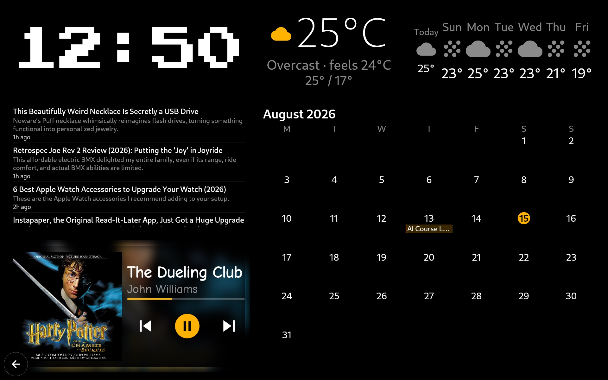
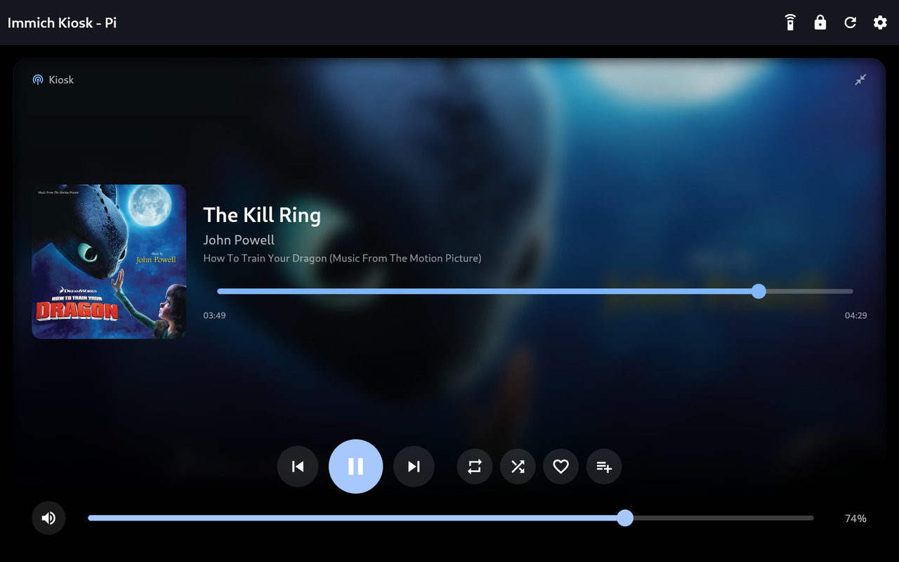
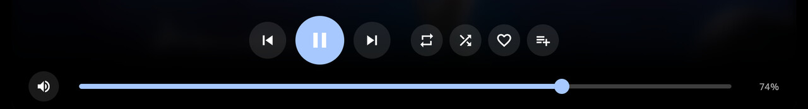
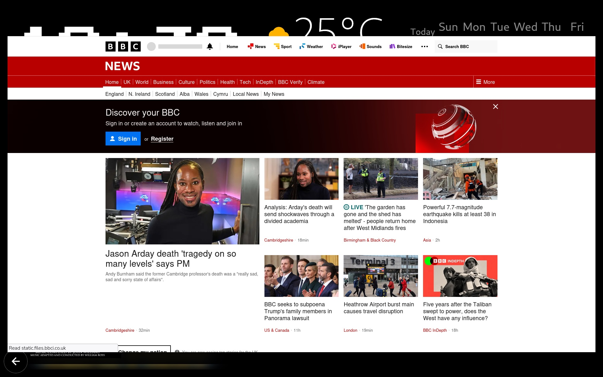

# ImmichKioskPi

A touchscreen photo frame, media browser and wall dashboard for your own
[Immich](https://immich.app) server, built for a Raspberry Pi with a DSI touch
display.

It boots straight into a fullscreen kiosk — no desktop, no mouse, no keyboard.
Browse your albums, pinch to zoom photos, play videos, run a slideshow, and see
the local weather. It doubles as a speaker (Bluetooth or Spotify Connect), takes
photos and notes shared from a phone, and can switch to a widget dashboard of
clock, weather, calendar, news and music that you arrange from a browser.

Built with Flutter as a native Linux app, so it stays smooth on a Pi.

**📖 [moreinfo.md](moreinfo.md) has the full setup guide, every optional
feature, the troubleshooting notes and the technical detail.** This page is the
short version.

---

## Screenshots

| Albums | Album contents |
|---|---|
|  |  |
| The home grid. Long-press albums to pick several for one slideshow. | An album's photos, with the Slideshow button in the bar. |

| Photo viewer | Slideshow with weather |
|---|---|
|  |  |
| Pinch, double-tap or the +/− buttons to zoom. | Photo-frame mode: the whole image fits, edges filled with a blur, weather in the corner. |

### The widget dashboard

Clock, weather, news, calendar and music on one screen — laid out on a 12×8
grid from a browser on your own network, no keyboard at the panel:



### Now playing

When music is playing and no slideshow is running, the player takes over
full-screen with a blurred album-art backdrop and large, quick-to-tap controls:

| Full-screen player | Controls close-up |
|---|---|
|  |  |
| Tap to shrink to a corner card and pick an album — it pops back up on its own if nothing came of it. | Transport, repeat, shuffle, like and add-to-playlist, all sized for a quick tap. |

### Shared links open in Firefox

A link shared from a phone opens with the browser's own furniture hidden, and a
close button the kiosk draws itself — because neither browser gives one you can
reliably hit with a thumb:



### Slideshow in motion

Ken Burns pan with a cross-fade between slides:


*(Also available as [MP4](docs/screenshots/05-slideshow-animation.mp4) at higher quality.)*

> Screenshots use albums without people in them, and every thumbnail on the
> albums grid is deliberately pixelated. Album artwork shown is © its
> respective rights holder, fetched live to demonstrate the UI; this project
> claims no ownership of it.

---

## Features

**Photos & video** — browse every Immich album; full-screen viewer with
pinch-zoom, double-tap zoom and swipe; video via libmpv with a playback-speed
selector, scrub, zoom and volume; portrait and landscape without cropping.

**Slideshow** — fade, slide, Ken Burns or page-turn transitions, configurable
interval, shuffle, a blurred backdrop behind letterboxed shots, and multi-select
albums played as one.

**Widget dashboard** — clock, weather, calendar, RSS news, Spotify and a TV
remote on a 12×8 grid, arranged from a browser with a live preview. Five themes
plus a JSON template for your own, twenty fonts, per-widget sizing.

**Weather** — corner panel, tap to expand into a 7-day forecast. Uses
[Open-Meteo](https://open-meteo.com), no API key.

**Indoor sensor** — reads a Govee H510x Bluetooth thermometer via Home
Assistant, with a 24-hour chart in the expanded panel.

**Music** — pair a phone over Bluetooth and the Pi becomes its speaker with a
now-playing panel, or use Spotify directly: the Pi appears as a Connect device
named "Kiosk", and with Premium the panel controls the account over the Web API
(seek, like, add to playlist).

**Share Inbox** — a companion Android app (in this repo) shares photos, GIFs,
videos, links and notes to the kiosk from any app's share sheet, from anywhere.
Per-person tokens, a chime, and a Do Not Disturb switch. Everything is
**end-to-end encrypted** with a fresh key per message.

**A phone as a wireless camera** — an old Android phone running IP Webcam
becomes a camera in a corner window; tap to expand, pinch to drive the phone's
own sensor zoom.

**Private content** — opens Immich's server-side Locked Folder with your PIN,
and re-locks when you leave.

**Built for a kiosk** — panels drift slowly to guard against burn-in; the screen
turns itself off when idle and wakes on touch; starts on boot and restarts if it
crashes; aggressive on-disk caching; an About screen listing every library and
licence.

---

## What you need

- **Raspberry Pi 5** (or Pi 4) with a DSI touch display — developed against a
  10" 1200×1920 panel used in landscape
- **Raspberry Pi OS (Debian 13 "trixie")** or similar, running the **labwc**
  Wayland session
- An **Immich server** (v3.x) reachable on your network
- A computer to build from, or build directly on the Pi

---

## Quick start

**1. Install the toolchain on the Pi**

```bash
bash scripts/pi-setup.sh
```

Installs Flutter, the Linux build dependencies and libmpv. Needs `sudo` and
downloads a few hundred MB.

**2. Set up the touchscreen** — merge [`deploy/labwc-rc.xml`](deploy/labwc-rc.xml)
into `~/.config/labwc/rc.xml`, changing `deviceName` to yours (find it with
`libinput list-devices`) and `mapToOutput` to your panel. `mouseEmulation="no"`
is the important part — it delivers real touch events rather than synthetic
mouse ones.

**3. Point the helper scripts at your Pi**

```bash
cp scripts/local.env.example scripts/local.env
```

Edit it with your Pi's SSH details. It's git-ignored, so your hostname stays out
of the repo.

**4. Add your Immich details** — create `~/.config/immich_kiosk_pi/config.json`
on the Pi (see [`config.example.json`](config.example.json)) with your server URL
and an API key from **Account Settings → API Keys**, then `chmod 600` it.

**5. Build and run**

```bash
scripts/run.sh
```

Syncs the source to the Pi, builds a release binary there, and launches it.

**6. Start it on boot**

```bash
mkdir -p ~/.config/systemd/user ~/.config/labwc
cp deploy/immich_kiosk_pi.service ~/.config/systemd/user/
cp deploy/labwc-autostart ~/.config/labwc/autostart
chmod +x ~/.config/labwc/autostart
systemctl --user daemon-reload
systemctl --user enable --now immich_kiosk_pi
```

> Start units from labwc's `autostart`, not from `graphical-session.target` —
> labwc never activates it, so anything bound to it silently never runs. This
> caused three separate "worked until I rebooted" faults.

**Everything else** — Bluetooth, Spotify, the camera, the dashboard, the share
inbox, voice control, the Locked Folder — is in
**[moreinfo.md](moreinfo.md)**.

---

## Privacy

ImmichKioskPi talks only to your own Immich server and to Open-Meteo for the
weather. There's no analytics and no third-party service. Your credentials live
in `~/.config/immich_kiosk_pi/config.json` on the device and are never committed
— that file is git-ignored. Shares from the companion app are end-to-end
encrypted, so even a reverse proxy in the path cannot read them.

---

## Licence

[MIT](LICENSE) — do what you like with it, no warranty.

Third-party libraries, their licences and credits for adapted code are listed in
[moreinfo.md](moreinfo.md#third-party-libraries) and on the device under
**Settings → About**, so attribution travels with the app.
