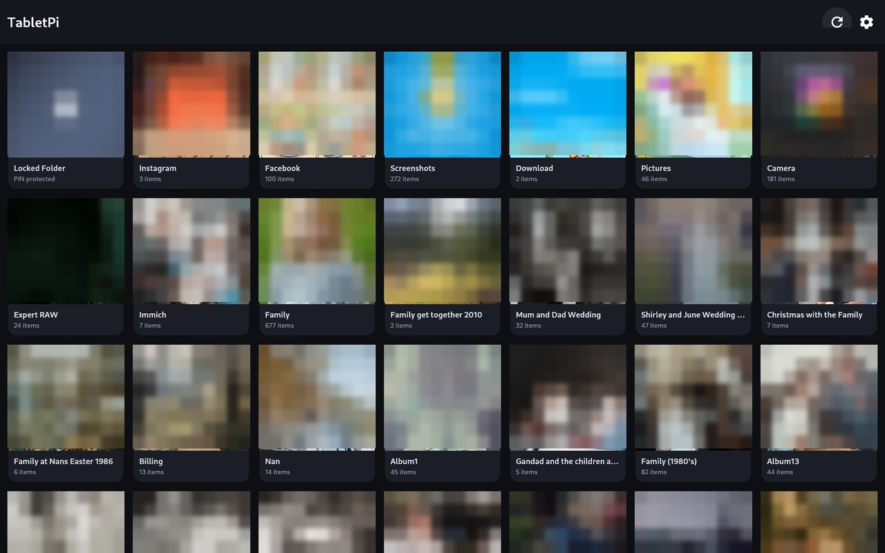
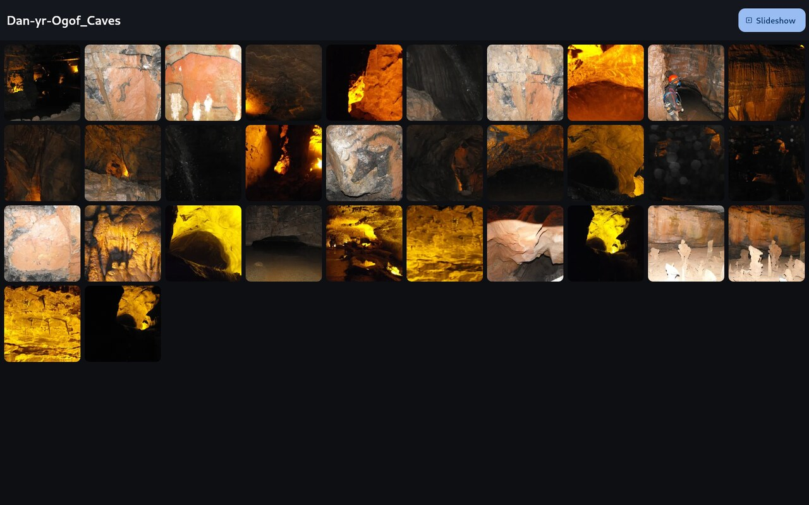
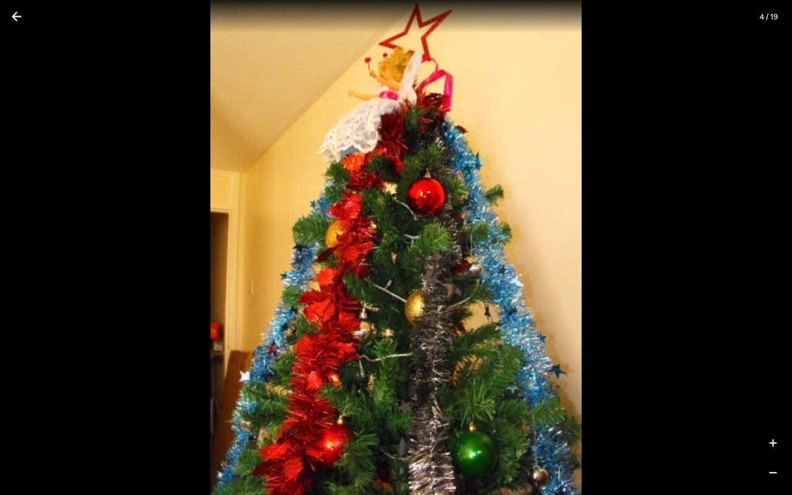
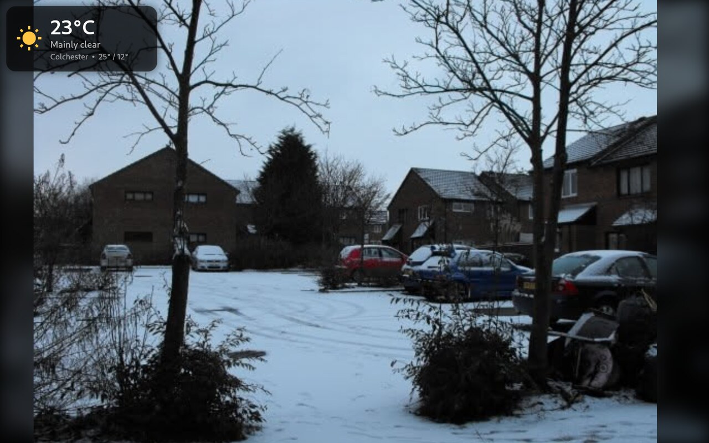
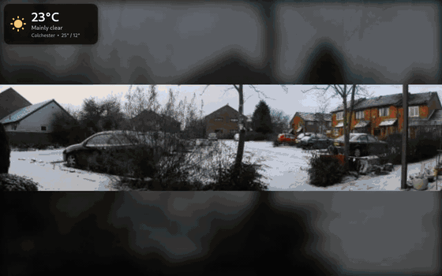

# ImmichKioskPi

A touchscreen photo frame and media browser for your own [Immich](https://immich.app)
server, built for a Raspberry Pi with a DSI touch display.

It boots straight into a fullscreen kiosk — no desktop, no mouse, no keyboard.
Browse your albums, pinch to zoom photos, play videos with speed control, run a
slideshow with transitions, and see the local weather forecast.

Built with Flutter (native Linux), so it stays smooth on a Pi.

---

## Features

**Photos & video**
- Browse all your Immich albums with cover thumbnails
- Full-screen viewer with pinch-zoom, double-tap zoom and swipe
- Video playback via libmpv with a **playback-speed selector** (0.25×–2×),
  scrub, zoom, and a vertical **volume slider with mute** — the level and mute
  state carry over to the next video
- Handles portrait and landscape media without cropping

**Slideshow**
- Fade, slide or **Ken Burns** transitions
- Configurable interval, shuffle, and a blurred backdrop behind letterboxed shots
- **Multi-select albums** and play them all as one combined slideshow
- Images are fully decoded before they animate, so slides never flicker in

**Private content**
- Opens Immich's server-side **Locked Folder** with your PIN, and re-locks when
  you leave

**Indoor sensor**
- Reads a **Govee H510x** Bluetooth thermometer/hygrometer passively from its
  BLE broadcasts — no pairing, no account, no cloud
- Indoor temperature and humidity appear on the weather panel, with a **line
  chart of recent readings** in the expanded view, and a low-battery warning

**Weather overlay**
- Corner panel showing current conditions, tap to expand into a full-screen
  **7-day forecast** with colour-coded icons
- Uses [Open-Meteo](https://open-meteo.com) — **no API key needed**
- Choose the location (UK postcode or place name), the screen corner, and °C/°F

**Now playing from your phone**
- Shows the track your paired phone is playing, with album artwork, in a corner
  of the slideshow
- Tap it to expand into a full player with **play/pause, next, previous, repeat,
  shuffle, and a volume slider with mute** — the controls drive the phone
- Works with any app on the phone (Spotify, YouTube Music, podcasts) because it
  reads Bluetooth AVRCP rather than any one service's API
- Optionally **leave the audio on the phone** (headphones) and use the kiosk
  purely as a remote control
- Tidies itself away: the panel hides after a minute of nothing playing and
  reappears the moment playback resumes

**Built for a kiosk**
- On-screen panels **drift slowly** by a few pixels so nothing sits on the same
  pixels for long — guards an always-on display against image retention
- Starts on boot, restarts automatically if it crashes
- Restart / power-off buttons in Settings
- Aggressive on-disk caching so it's fast and works well on a slow network
- An **About** screen listing every library, licence and credit
- Optional **TV Remote** button that switches to a companion remote-control app
  when one is running (see below)

---

## Screenshots

| Albums | Album contents |
|---|---|
|  |  |
| The home grid, with the Locked Folder tile first. Long-press albums to pick several for one slideshow. | An album's photos, with the Slideshow button in the bar. |

| Photo viewer | Slideshow with weather |
|---|---|
|  |  |
| Full-screen viewer — pinch, double-tap or the +/− buttons to zoom. | Photo-frame mode: the whole image fits, edges filled with a blur, and the weather panel in the corner. |

### Slideshow in motion

Ken Burns pan with a cross-fade between slides:



*(Also available as [MP4](docs/screenshots/05-slideshow-animation.mp4) at higher quality.)*

> Screenshots use albums without people in them. On the albums grid every
> thumbnail is deliberately pixelated, since that page shows personal photos.

---

## What you need

- **Raspberry Pi 5** (or Pi 4) with a DSI touch display — developed against a
  10" 1200×1920 panel used in landscape
- **Raspberry Pi OS (Debian 13 "trixie")** or similar, running the **labwc**
  Wayland session
- An **Immich server** (v3.x) reachable on your network
- A computer to build from, or build directly on the Pi

---

## Quick start

### 1. Install the toolchain on the Pi

SSH into the Pi and run:

```bash
bash scripts/pi-setup.sh
```

This installs Flutter, the Linux build dependencies and libmpv. It needs `sudo`
and downloads a few hundred MB, so give it a few minutes.

```bash
nano ~/.config/labwc/rc.xml
```

Edit that file 

```xml
<touch deviceName="<your touch device>" mapToOutput="DSI-1" mouseEmulation="no"/>
```

Find the device name via libinput list-devices (or let Screen Configuration write the entry, then edit it). Reboot after. CNX Software tested exactly this and got all 10 points tracking correctly afterwards

### 2. Point the helper scripts at your Pi

On the machine you're building from:

```bash
cp scripts/local.env.example scripts/local.env
```

Edit it with your Pi's SSH details:

```sh
PI_HOST=pi@immich_kiosk_pi.local
PI_DIR=/home/pi/immich_kiosk_pi
```

This file is git-ignored, so your username and hostname stay out of the repo.

### 3. Add your Immich details

Create `~/.config/immich_kiosk_pi/config.json` **on the Pi** (see
[`config.example.json`](config.example.json)):

```json
{
  "immichUrl": "https://immich.example.com",
  "apiKey": "YOUR_IMMICH_API_KEY"
}
```

Generate the API key in Immich under **Account Settings → API Keys**. Keep the
file private:

```bash
chmod 600 ~/.config/immich_kiosk_pi/config.json
```

You can also enter these on first run, though a keyboard is easier than the
on-screen fields.

### 4. Build and run

```bash
scripts/run.sh
```

This syncs the source to the Pi, builds a release binary there, and launches it
on the display.

### 5. Start it on boot

On the Pi:

```bash
mkdir -p ~/.config/systemd/user ~/.config/labwc
cp deploy/immich_kiosk_pi.service ~/.config/systemd/user/
cp deploy/labwc-autostart ~/.config/labwc/autostart
chmod +x ~/.config/labwc/autostart
systemctl --user daemon-reload
systemctl --user enable --now immich_kiosk_pi
```

The service file uses systemd's `%h` and `%U` specifiers, so it works whatever
your username is.

---

## Optional setup

### Power-off button

To let the in-app **Restart** and **Power off** buttons work without a password
prompt, run once on the Pi:

```bash
sudo bash deploy/enable-poweroff.sh
```

### Now playing from your phone

The now-playing panel reads Bluetooth **AVRCP**, so it works with whatever app
your phone is using — no accounts or API keys.

Pair the phone with the Pi once:

```bash
bluetoothctl
# then, at the prompt:
#   power on
#   agent NoInputNoOutput
#   default-agent
#   pairable on
#   discoverable on
# accept the passkey on both the phone and here, then:
#   trust <PHONE_MAC>
```

Play something on the phone with **media audio** routed to the Pi. The panel
appears in the slideshow; tap it to expand, tap again to shrink.

> **Trade-off worth knowing:** AVRCP metadata rides along with the Bluetooth
> audio stream, so the phone's audio plays through the **Pi**, not the phone.
> That's inherent to this approach, not a choice of implementation.

#### Using headphones on the phone

If you'd rather the music kept playing on the phone — Bluetooth headphones, its
own speaker — turn **Settings → Now playing → "Play the audio on this device"**
off. The Pi then stops acting as an audio sink, but the panel keeps showing the
track and the controls still work: this display becomes a pure remote.

That works because AVRCP's control channel is independent of the A2DP audio
stream, so `org.bluez.MediaPlayer1` survives with the audio profile switched
off. The setting is re-applied whenever the phone reconnects, since PipeWire
turns the audio profile back on by itself.

With the setting on, PipeWire routes the incoming stream to whatever output is
active — a USB speaker, for example. Check the link with:

```bash
pw-link -l | grep bluez
```

(Note `pactl` may not be installed on Raspberry Pi OS; `pw-link` and `wpctl`
are the PipeWire tools that are.)

Two things that look like faults but aren't: those links only exist while audio
is **actively streaming**, so a paused track shows none; and `wpctl inspect`
can report a stale `bluez5.profile`. Neither is a reliable way to tell whether
audio routing is enabled — the setting itself is the source of truth.

The volume slider sets **AVRCP absolute volume**, i.e. the level the phone is
sending — the same control as the phone's own volume buttons. It is not a
local mixer level for the Pi's output.

Album artwork isn't part of AVRCP, so it's looked up from the free
[iTunes Search API](https://performance-partners.apple.com/search-api) using the
artist and track name. Searching by track is markedly more reliable than by
album, because AVRCP album strings often carry suffixes like
`(Deluxe Version) [Explicit]`.

### Indoor temperature sensor

The indoor reading comes from a Govee H510x (H5101/H5102/H5104/H5177), which
broadcasts temperature and humidity in its Bluetooth LE advertisements.

**The kiosk doesn't scan for it.** Home Assistant already watches the same
sensor full-time via its `govee_ble` integration, so the kiosk reads the value
from Home Assistant's REST API instead. Two things scanning the same air gained
nothing, and BLE scanning on the Pi's built-in radio makes Bluetooth audio
stutter, because that radio shares one antenna with A2DP.

Configure it under **Settings → Home Assistant**: server URL, a long-lived
access token and the entity IDs. Without a token the indoor reading is simply
hidden.

Tokens are long and awkward to type on a touchscreen, so there's a helper that
takes one on the Pi and checks it works before saving:

```bash
bash ~/immich_kiosk_pi/scripts/set-ha-token.sh
```

Create the token in Home Assistant under your user name → Security → Long-lived
access tokens.

The 24-hour chart in the expanded weather panel comes from Home Assistant's
history API, thinned to roughly one point per ten minutes so the chart doesn't
try to draw thousands of segments.

**If you want Bluetooth audio and BLE sensing at once, use two radios.** A USB
BLE dongle costs very little and removes the contention entirely: leave the
built-in `hci0` for audio and give Home Assistant the dongle. In Home
Assistant, disable the Bluetooth config entry for the built-in adapter —
it auto-discovers every adapter it finds, so otherwise it will scan on both.
BlueZ only powers extra controllers at boot when `AutoEnable=true` is set in
`/etc/bluetooth/main.conf`.

### Turning the screen off with Alexa

The panel can be switched off by voice, with no cloud account, no Amazon
developer account and nothing exposed to the internet. Three pieces:

1. **`deploy/screen_control.py`** — a small HTTP service on the host. Home
   Assistant runs in a container and can't reach the host's Wayland session, so
   it can't call `wlopm` itself. This runs as the user who owns that session and
   binds to localhost only:

   ```
   /screen                 state as JSON
   /screen/on              /screen/off      /screen/toggle
   /screen/brightness?value=0-100
   ```

   Install it alongside the kiosk unit:

   ```bash
   cp deploy/screen-control.service ~/.config/systemd/user/
   systemctl --user enable --now screen-control.service
   ```

2. **A `command_line` switch in Home Assistant** that curls it. Home Assistant
   uses host networking, so `127.0.0.1:8765` reaches the host service.

3. **`emulated_hue`**, which presents that one switch to Alexa as a Philips Hue
   V1 bridge. Alexa has native Hue support, so nothing else is needed. Say
   *"Alexa, discover devices"*, then *"Alexa, turn off the kiosk screen"*.

Both YAML blocks are in `deploy/homeassistant.yaml`, ready to append to Home
Assistant's `configuration.yaml`.

Name the device in the Alexa app carefully: if the name collides with an Echo,
a speaker or a group, Alexa matches that instead and the light is never
reached — the app button keeps working, so it looks like a voice problem when
it isn't. "Kiosk" alone collided here; "Kiosk screen" was fine.

Two constraints worth knowing, both from Alexa rather than this project:

- **It must listen on port 80.** Amazon stopped talking to other ports in the
  August 2019 Echo firmware.
- **The Pi needs a fixed address.** Alexa caches the bridge by IP, so a DHCP
  lease change silently breaks it. A reservation on the router is the tidiest
  way; `emulated_hue`'s `host_ip` must match.

**Touch wakes it again — which is why "off" dims rather than powers down.**
Cutting the DSI output also cuts power to the touch controller, so the panel
stops reporting touches altogether and nothing in software can wake it. Measured
on this display: 13 touch events with the output on, none at all with it off.

So `/screen/off` sets the backlight to zero and leaves the output powered, and
`screen_control.py` watches the touchscreen to turn it back up. `/screen/off?deep=1`
still powers the output right down, for when the extra saving matters more than
being able to wake it by hand.

Devices to watch come from `/proc/bus/input/devices` — anything with a `mouse`
handler, which is the touch panel and any real mouse. Keyboard-style devices are
deliberately excluded: the paired phone's AVRCP media keys appear as one, and a
track change shouldn't wake the screen. Reading the touchscreen needs membership
of the `input` group.

Power changes and wakes are recorded in `~/.cache/immich_kiosk_pi/screen_control.log`,
which is the quickest way to tell whether a touch was seen at all.

### TV Remote button

If you run a companion remote-control app on the same Pi, a **TV Remote** icon
appears in the home screen's toolbar and switches to it with one tap. The
button only appears while that app is actually running, so it stays out of the
way otherwise.

It shells out to [`wlrctl`](https://git.sr.ht/~brocellous/wlrctl) to spot the
window and focus it:

```bash
sudo apt-get install -y wlrctl
```

The app is matched by Wayland `app_id`, set by `_remoteAppId` in
`lib/screens/home_screen.dart` (currently `com.vwillcox.vidaa_remote`) — change
it there to point at your own app. Without `wlrctl`, or without that app
running, the button simply never appears and nothing else is affected.

### Locked Folder

Immich's Locked Folder is protected by a login **session**, which an API key
can't unlock. To use it, the app needs your Immich account login. Run on the Pi:

```bash
bash deploy/set-immich-login.sh
```

It prompts for your email and password (hidden) and stores them in
`~/.config/immich_kiosk_pi/config.json`. A **Locked Folder** tile then appears on the
home screen; tap it and enter your PIN.

> Your password is stored in plain text in that file, readable only by your
> user. If you'd rather not do that, simply skip this step — everything else
> works without it.

---

## Gestures

| Where | Gesture | Action |
|---|---|---|
| Albums | long-press | start multi-select |
| Albums | tap (while selecting) | add / remove album |
| Photo | pinch or double-tap | zoom in and out |
| Photo | drag (zoomed) | pan |
| Photo | swipe left / right | previous / next |
| Photo | swipe down | close |
| Photo | tap | hide / show controls |
| Slideshow | swipe left / right | previous / next (pauses) |
| Slideshow | swipe down | exit |
| Slideshow | tap | hide / show controls |
| Video | double-tap left / right | skip back / forward 10s |
| Video | double-tap centre | play / pause |
| Video | drag horizontally | scrub |
| Video | drag vertically | volume |
| Video | tap the speaker icon | mute / unmute |
| Video | drag the right-edge slider | volume |
| Video | swipe down | close |
| Weather panel | tap | expand / collapse the forecast |
| Now playing panel | tap | expand / collapse the player |

On-screen +/− zoom buttons are also provided as a fallback.

---

## Settings

Tap the gear icon on the home screen:

- **Connection** — Immich server URL and API key
- **Locked Folder** — whether the account login is configured
- **Weather** — on/off, location, screen corner, °C/°F
- **Now playing** — show what the paired phone is playing, and which corner
  (the expanded player also carries volume and mute)
- **Slideshow** — seconds per photo, transition style, shuffle
- **Storage** — how much the photo cache is using, with a Clear button
- **Device** — Restart and Power off
- **About** — version, the open-source libraries used with their licences and
  links, and credits for code adapted from elsewhere

---

## Development

The project is built on the Pi (it's an arm64 Linux target), but you can keep
the source on another machine and sync it over:

```bash
scripts/sync.sh        # copy source to the Pi
scripts/run.sh         # sync, build release, restart the kiosk
scripts/run.sh debug   # sync, then flutter run with hot reload
scripts/shot.sh        # screenshot the Pi's display to a PNG
```

Everything is configured through `scripts/local.env` (see step 2), or you can
override `PI_HOST` / `PI_DIR` as environment variables.

Handy service commands on the Pi:

```bash
systemctl --user restart immich_kiosk_pi
journalctl --user -u immich_kiosk_pi -f
```

The window is fullscreen and borderless by default. Set `IMMICH_KIOSK_WINDOWED=1`
to run it in a normal window while debugging.

#### Debug launch hooks

Environment variables that boot straight into one screen — handy for capturing
screenshots or testing a screen in isolation. They're inert unless set.

| Variable | Opens |
|---|---|
| `IMMICH_KIOSK_TEST_ALBUMGRID=<albumId>` | an album's asset grid (`IMMICH_KIOSK_TEST_ALBUMNAME` sets its title) |
| `IMMICH_KIOSK_TEST_GALLERY=<albumId>` | the photo viewer (`IMMICH_KIOSK_TEST_GALLERY_INDEX` picks the photo) |
| `IMMICH_KIOSK_TEST_SLIDESHOW=<albumId>` | the slideshow |
| `IMMICH_KIOSK_TEST_VIDEO=<assetId>` | the video player |
| `IMMICH_KIOSK_TEST_LOCKED=<pin>` | the Locked Folder, unlocked |
| `IMMICH_KIOSK_TEST_LOCKED_VIDEO=<pin>` | the first locked video |
| `IMMICH_KIOSK_TEST_ABOUT=1` | the About screen |
| `IMMICH_KIOSK_TEST_NOWPLAYING=1` | the now-playing panel on a blank background |

### Screen burn-in

The weather and now-playing panels are the only things that stay put on an
always-on display, so they drift continuously within a 24px radius, tracing a
slow Lissajous path (17- and 23-minute periods on the two axes, recomputed
every 20 seconds — about two pixels a step, below the threshold of notice).

The panels' margin is deliberately larger than the drift amplitude: if a panel
clamped against a screen edge it would sit still there, which is the problem
this is meant to solve. See `lib/widgets/burn_in_drift.dart`.

### Project layout

```
lib/
  main.dart                    # app entry, providers, root routing
  theme.dart                   # dark, touch-first theme
  config/app_config.dart       # settings model
  models/immich_models.dart    # Album, Asset
  services/
    config_service.dart        # reads/writes config.json
    immich_service.dart        # Immich REST client + response caching
    locked_folder_service.dart # session login, PIN unlock, re-lock
    media_source.dart          # API-key vs session-token media access
    media_cache.dart           # on-disk image cache + memory tuning
    api_cache.dart             # cached API responses
    weather_service.dart       # Open-Meteo forecast and geocoding
    now_playing_service.dart   # BlueZ AVRCP over D-Bus + artwork lookup
  config/credits.dart          # attribution data shown on the About screen
  screens/                     # home, album, gallery, video, slideshow,
                               # locked folder, settings, setup, PIN pad,
                               # about
  widgets/                     # cached image, back button, weather overlay
```

### How it talks to Immich

Immich v3 REST API, authenticated with the `x-api-key` header:

| Purpose | Endpoint |
|---|---|
| Album list | `GET /api/albums` |
| Album contents | `POST /api/search/metadata` with `albumIds` |
| Thumbnail / preview | `GET /api/assets/{id}/thumbnail?size=thumbnail\|preview` |
| Full image | `GET /api/assets/{id}/original` |
| Video stream | `GET /api/assets/{id}/video/playback` |

The Locked Folder additionally uses `POST /api/auth/login`,
`POST /api/auth/session/unlock`, then `POST /api/search/metadata` with
`visibility: locked`, and `POST /api/auth/session/lock` on exit — these need a
session token rather than an API key.

### Caching

Images and API responses are cached under `~/.cache/immich_kiosk_pi` — deliberately
**not** in `/tmp`, which on Raspberry Pi OS is a RAM-backed tmpfs. The cache
holds up to 20,000 files for a year, so restarts are near-instant. Clear it any
time from **Settings → Storage**.

---

## Troubleshooting

**Nothing appears on screen**
Check the service is running: `systemctl --user status immich_kiosk_pi`. It needs the
labwc Wayland session to already be up — that's why it's started from
`~/.config/labwc/autostart`.

**Some thumbnails don't load**
The app retries with backoff and falls back to the full-size image. If it
persists, the asset may not have a thumbnail generated in Immich yet.

**Videos play as a blank blue frame**
Hardware video decoding can produce an unsampleable surface on this GL path, so
the player forces software decoding. If you've changed that, change it back in
`lib/screens/video_player_screen.dart`.

**Text fields are hard to fill in**
There's no on-screen keyboard, so the server URL, API key and login are easiest
to set by editing `~/.config/immich_kiosk_pi/config.json` over SSH. The numeric PIN pad
is custom-built and works fine by touch.

**Harmless log noise**
`Failed to create AudioController: Unable to find mixer control: Master` is an
ALSA probe from media_kit; audio still works.

---

## Privacy

ImmichKioskPi talks only to your own Immich server and to Open-Meteo for the weather.
There's no analytics and no third-party service. Your credentials live in
`~/.config/immich_kiosk_pi/config.json` on the device and are never committed — that
file is git-ignored.

---

## Third-party libraries

The same list is available on the device under **Settings → About**, so
attribution travels with the app rather than living only here.

Built with [Flutter](https://flutter.dev) (BSD-3-Clause,
[source](https://github.com/flutter/flutter)).

### Dart packages

| Package | Used for | Licence |
|---|---|---|
| [provider](https://pub.dev/packages/provider) · [src](https://github.com/rrousselGit/provider) | State management / dependency injection | MIT |
| [dio](https://pub.dev/packages/dio) · [src](https://github.com/cfug/dio) | HTTP client for the Immich and weather APIs | MIT |
| [cached_network_image](https://pub.dev/packages/cached_network_image) · [src](https://github.com/Baseflow/flutter_cached_network_image) | Images with auth headers and caching | MIT |
| [flutter_cache_manager](https://pub.dev/packages/flutter_cache_manager) · [src](https://github.com/Baseflow/flutter_cache_manager) | On-disk cache, relocated to the NVMe | MIT |
| [file](https://pub.dev/packages/file) · [src](https://github.com/google/file.dart) | Filesystem abstraction for the custom cache | MIT |
| [media_kit](https://pub.dev/packages/media_kit) · [src](https://github.com/media-kit/media-kit) | Video playback and speed control | MIT |
| [media_kit_video](https://pub.dev/packages/media_kit_video) | Video render surface | MIT |
| [media_kit_libs_video](https://pub.dev/packages/media_kit_libs_video) | Native video dependencies | MIT |
| [dbus](https://pub.dev/packages/dbus) · [src](https://github.com/canonical/dbus.dart) | Talks to BlueZ for phone media metadata | MPL-2.0 |
| [path](https://pub.dev/packages/path) · [src](https://github.com/dart-lang/path) | Path joining for cache locations | BSD-3-Clause |
| [flutter_lints](https://pub.dev/packages/flutter_lints) (dev) | Lint rules | BSD-3-Clause |

### System libraries

| Library | Used for | Licence |
|---|---|---|
| [mpv / libmpv](https://mpv.io) · [source](https://github.com/mpv-player/mpv) | Video decoding behind media_kit | LGPL-2.1+ ([details](https://github.com/mpv-player/mpv/blob/master/Copyright)) |
| [BlueZ](http://www.bluez.org) · [source](https://github.com/bluez/bluez) | Bluetooth stack — AVRCP metadata and control | GPL-2.0+ / LGPL-2.1+ |
| [GTK 3](https://www.gtk.org) | Flutter's Linux embedder window | LGPL-2.1+ |

### Services

| Service | Used for | Terms |
|---|---|---|
| [Immich](https://immich.app) · [src](https://github.com/immich-app/immich) | Your own photo server (the whole point) | AGPL-3.0 |
| [Open-Meteo](https://open-meteo.com) | Weather forecast — no API key required | Free for non-commercial use, [CC BY 4.0](https://open-meteo.com/en/license) |
| [iTunes Search API](https://performance-partners.apple.com/search-api) | Album artwork lookup | Free, no key · Apple terms |
| [postcodes.io](https://postcodes.io) · [src](https://github.com/ideal-postcodes/postcodes.io) | UK postcode → coordinates | MIT, data under [OGL](https://www.nationalarchives.gov.uk/doc/open-government-licence/version/3/) |

---

## Credits and sources

Almost all of the code here was written for this project, but these parts come
from, or are adapted from, elsewhere:

- **Flutter project scaffolding** — `linux/runner/*`, `.metadata`,
  `analysis_options.yaml` and the initial `main.dart` were generated by
  `flutter create` and then modified (notably `my_application.cc`, changed to
  start fullscreen and borderless). Flutter SDK, BSD-3-Clause.
- **`_NvmeFileSystem`** in `lib/services/media_cache.dart` is modelled on
  [`IOFileSystem`](https://github.com/Baseflow/flutter_cache_manager/blob/develop/lib/src/storage/file_system/file_system_io.dart)
  from flutter_cache_manager (MIT), changed to store files under a fixed
  directory instead of the system temp directory.
- **Weather code descriptions and icon mapping** in
  `lib/services/weather_service.dart` and `lib/widgets/weather_overlay.dart`
  follow the WMO weather-code table as published in the
  [Open-Meteo API docs](https://open-meteo.com/en/docs).
- **Immich API usage** was derived from the
  [Immich API documentation](https://immich.app/docs/api) together with probing
  a live v3 server — in particular that album contents come from
  `POST /api/search/metadata`, and that the Locked Folder needs a session token
  rather than an API key.
- **Bluetooth now-playing** uses BlueZ's AVRCP support over D-Bus
  ([`org.bluez.MediaPlayer1`](https://github.com/bluez/bluez/blob/master/doc/org.bluez.MediaPlayer.rst))
  for metadata and transport control. Album art is not part of AVRCP, so it is
  resolved separately from the iTunes Search API by artist + track title.
- **Material Design icons** ship with Flutter (Apache-2.0).

No code was copied from Stack Overflow, blog posts or other projects.

---

## Licence

[MIT](LICENSE) — do what you like with it, no warranty.
